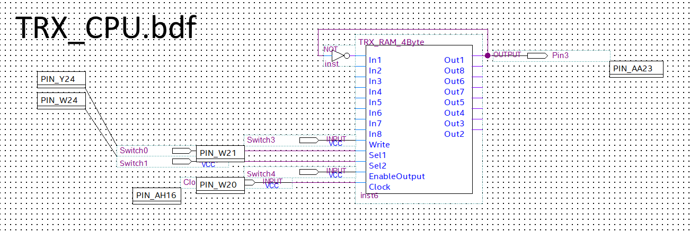
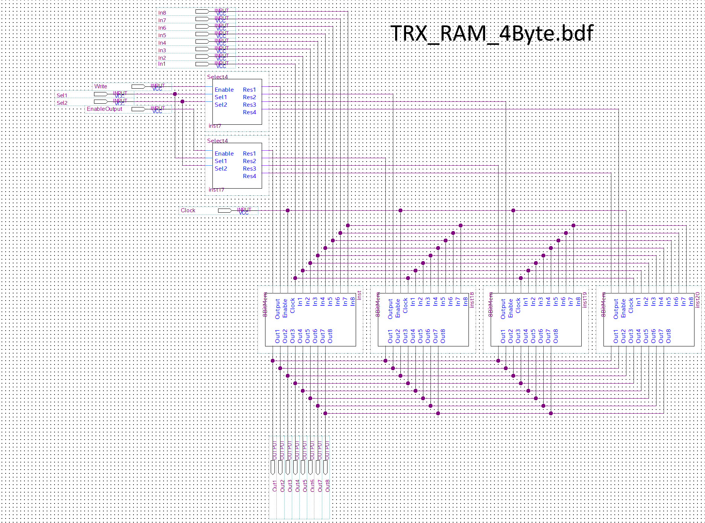
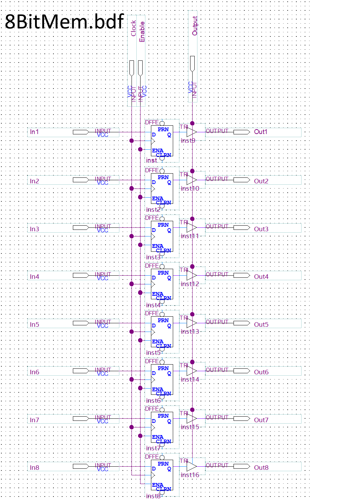

# TRX_CPU
Was curious to play with my FPGA a bit, and decided to try to build a very simple processor that could move memory values around a small RAM bank.

## TRX_CPU.bdf

## TRX_RAM_4Byte

## Select4.bdf

## 8BitMem.bdf

